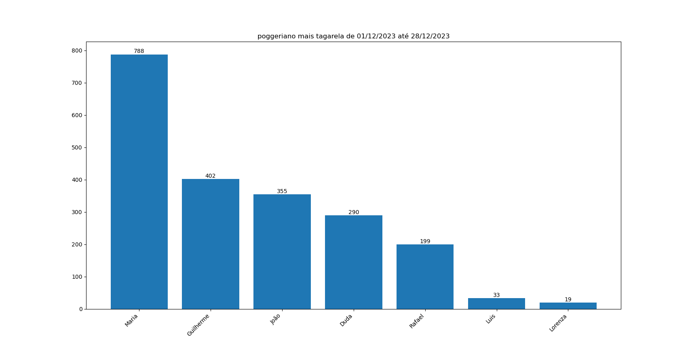

## Contador de Mensagens no WhatsApp
Este script em Python permite gerar um gráfico visualizando as pessoas que mais interagem em um determinado período, com base em dados de uma conversa exportada de um grupo do WhatsApp. Além disso, o script gera um arquivo .xlsx contendo o total de mensagens para cada usuário dentro do período analisado.

## Resultado
O script gera um gráfico mostrando os usuários mais ativos no chat. Por padrão, este gráfico é salvo automaticamente na pasta Downloads, mas você pode alterar o caminho de salvamento ou desativar o salvamento automático no código.



## Instalação
Siga as etapas abaixo para configurar e executar o script:
1. Clone o repositório:

   ```bash
   git clone https://github.com/PriscilaButzke/Contabilizador-mgs-WhatsApp.git
   cd Contabilizador-mgs-WhatsApp
   ```
2. Instale as dependências necessárias:
Certifique-se de que você tenha o Python instalado. Em seguida, instale as bibliotecas requeridas usando:

   ```bash
   pip install -r requirements.txt
   ```
3. Exporte a conversa de um grupo do WhatsApp como um arquivo de texto:

Android:    
- No WhatsApp, abra o grupo do qual você deseja extrair as mensagens.
- Clique nos três pontos no canto superior direito, selecione "Mais" e depois "Exportar conversa".


IOS: 
- No WhatsApp, abra o grupo do qual você deseja extrair as mensagens.
- clique no titulo do grupo
- role ate o final 
- opção "Exportar conversa"
- escolha opção "sem midia". 


Salve o arquivo exportado no diretório do projeto com o nome _chat.txt.

4. Para iniciar o projeto, excute:
   
   ```bash
   python grafico2.0.py
    ```
5. O grafico com o numero escolhido para os usuários que mais conversam sera salvo na pasta de Downloads.


   E o arquivo com extensão .xlsx com os contabilizador de mensagens por usuário sera salvo na pasta do projeto. 


